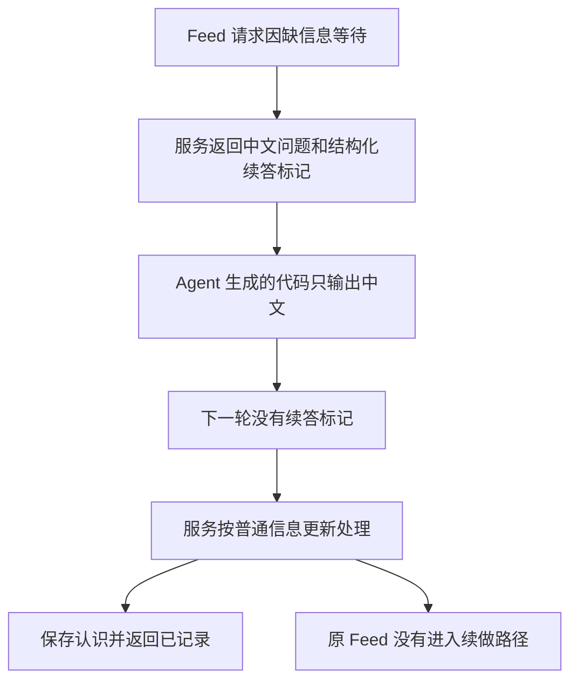

# A02 自动续做断路：时间线与可靠性调查

调查日期：2026-09-07；时间统一为北京时间（UTC+08:00）。本轮只调查和做隔离实验，暂不修改运行代码或 Skill，不决定最终修复方案。

## 结论

这次未推进 Feed 的直接原因已确定：任务中由 Agent 生成的调用代码只输出 MCP 返回值的 `content` 文字，没有保留或输出 `structuredContent`；后续每次 `observe_context` 都没有传入 `continuationToken`。服务因此按普通信息更新处理，没有进入原 Feed 的续做路径。

更早的解释需要收窄：“Codex 接入丢了关联”不能理解为已证明 Codex 的 MCP 传输层丢字段。已看到的丢弃发生在 Agent 生成的结果提取代码中。当前同一工具环境的一次只读调用能同时取得 `content` 和 `structuredContent`；较早的手验也正确传递过标记。没有证据证明平台始终丢弃结构化结果。

但它确实是产品使用链的可靠性缺口：关键关联依赖 Agent 每轮正确读取、保管、更新、传回；漏传又与正常普通更新完全同形，系统不能明确告知用户“原请求已经接不上”。这不是仅靠一次后端测试成功能消除的风险。

## 1. 证据范围与当前版本

- 故障任务：[准备 Personal Feed 验收服务](thread://01a07949-deb2-7bd3-91f8-139388cf8326?hostId=local)。已先通过任务读取接口查阅，再按原始调用记录补齐最新四轮未显示内容的缺口。任务读取接口的空 `items` 不能当作“没有调用”的证据。
- 对照任务：[获取个人 Feed](thread://01a07934-785e-7081-ad45-1745cc24de8a?hostId=local)。该任务较早的多轮参数确实包含续答标记，最终失败在来源采集。
- 自验依据：[此前验收记录](v2-acceptance-2026-09-06.md)、[三种 A02 调用证据](v2-context-call-evidence.json)，并回看协调任务当时的实际调用代码。
- 服务 journal 的精确时间、PID、操作、顶层结果和耗时。没有把顶层 `applied` 当作 Feed 成功；自动续做也不会另记一条外部 `request`，因此不能仅靠“没有第二条 request 日志”断言未续做。
- 当前源码为 `1d6ec6f32bca1c95cb84bc908cef42c8f350ed38`。实际进程 PID `3451873`，构建目录 `manual-a02-2-20260907T083643`；14 个 TypeScript sourcemap 源文件与仓库一致，Python 副本一致，安装 Skill 与仓库一致，模型传输为 `strict_tool`。
- 当前状态目录为 `/home/herman/.local/state/personal-feed-acceptance/manual-a02-2-20260907T083643`，generation 6，关注 1、认识 1；只有个人信息文件，没有借此次调查请求 Feed 或补写画像。
- 四组反事实实验使用真实 MCP SDK、MCP 层、应用逻辑和临时存储；模型和 X 均为确定性替身。没有调用真实模型或浏览器，没有改变现有验收状态。

本报告不保存实际续答标记、MCP token、模型凭据或 X 正文。以下时间、分支、状态及代码片段足以核对机制。

## 2. 从之前验收到这次故障的时间线

| 时间 | 已发生的事 | 对判断的意义 |
| --- | --- | --- |
| 09-06 20:48:34 | 提交 `3b05ca3`，实现补足后继续原 Feed。关联放在进程内 Map，续答者必须带 token。 | 这是设计前提，不是这次才出现的规则。 |
| 09-07 07:31–07:40 | 我实际执行三种 A02 分支。调用代码显式保存完整工具结果，从 `structuredContent` 取出 token，传入下一次调用；部分步骤在同一编排代码中连续执行。 | 验证了“调用方正确保管关联时”服务能续做，没有验证任意自然对话 Agent 都会正确保管。 |
| 07:45–07:49 左右 | 新任务 A08 用已有充分信息请求一次 Feed；A09 重启后请求。分别得到正常空、正文不足，没有画像追问。 | 验证信息保留及调用，不覆盖缺信息后的多轮接入行为。 |
| 08:00:32 | 提交 `ea1e138`，包含追问、失败呈现、诊断和可选模型严格输出等返工。 | `strict_tool` 解决的是模型到服务的输出结构，不是服务到 Codex 的续答标记传递。 |
| 08:02:53 | 切换到新的空白验收状态。 | 后续第一次手验从空状态开始。 |
| 08:11:30–08:12:41 | “获取个人 Feed”任务先请求，再依次补充含糊表达、明确关注、原有认识；调用代码输出完整结果，三个补充调用均带 token。 | 普通用户任务也存在正确路径，不能说自然对话必然失败。 |
| 08:13:00 | 该任务呈现“认识已记录，但获取来源失败”。 | 这一次续答已经走到来源阶段，和当前断路不同。 |
| 08:14–08:22 左右 | 现场发现浏览器只有详情页，旧采集器只接受时间线入口；修复无入口时自动开首页。33 项 Python 测试通过；实机新开 1 页、三个来源完成，原页面不变。 | 是来源入口缺口，不能修复或解释当前 token 丢失。 |
| 08:24:02 | 提交 `1d6ec6f`；08:24:32 再次切空状态。 | 自动开页修复已进入后续版本。 |
| 08:34–08:37 | 新任务按用户确认重新准备标为 A02-2 的空白状态，并重新构建、启动。08:36:54 启动 PID `3451873`。 | 当前验收已不是本任务早先配置的状态；调查核对了真实运行版本，没有沿用旧控制记录。 |
| 08:39–08:43 | 同一服务连续处理两次 Feed 请求和四次补充，没有中途重启。 | 排除“服务在问答中重启导致 token 失效”作为这次直接原因。 |

“A02-2”是准备目录的标签；第一次 Feed 发出时两类信息都为空，实际起点相当于两类信息均缺。后来保存关注并再次请求才进入只缺认识的情形。这个标签差异不解释任何一次 token 丢失。

## 3. 故障任务的逐轮时间线

下表调用时间来自任务记录，完成时间来自同一 PID 的服务 journal；正常会有几毫秒的记录差。

| 调用开始 → 服务完成 | 用户动作 | 实际输入与可见返回 | 原 Feed 的关联发生了什么 |
| --- | --- | --- | --- |
| 08:39:39 → 08:39:41 | 第一次“给我一次个人 Feed” | `request`；工具文字说等关注和认识。调用脚本只输出 `r.content` 的文字。 | 依已核实代码，问题必须与 token 同时在结构化结果中返回；但调用脚本没有把结构化结果保留下来。原始完整响应未被该脚本记录，不能补造其具体值。 |
| 08:39:53 → 08:40:04 | “我大概都了解一点” | `observe_context` **没有 token**；返回 `ignored`，没有新问题或 Feed。 | **第一个确定的续答断点。** 服务未将它识别为第一次请求的续答。 |
| 08:40:42 → 08:40:45 | 明确长期关注 | `observe_context` 仍没有 token；返回 `applied`。 | 关注保存，但没有接回第一次等待中的 Feed。 |
| 08:41:10 → 08:41:14 | 再次“给我一次个人 Feed” | `request`；这次只问已有认识；脚本仍只取文字。 | 新请求建立新的等待关联，相同的信息丢弃模式再次发生。 |
| 08:41:34 → 08:42:06 | 再次“我大概都了解一点” | `observe_context` 没有 token；`ignored`，另有“具体了解或上手过什么”的问题。 | 代码路径是普通更新中的澄清，不携带第二次 Feed 的等待意图。**有新问题，不代表原 Feed 仍接着。** |
| 08:42:43 → 08:43:00 | “没有实操过。” | `observe_context` 没有 token；`applied`，无 `feed`。08:43:05 助手只说已记录。 | 保存“没有经验”这个认识；没有执行原请求的充分性判断或来源采集。 |

第一处漏传发生在 08:39:53，早于 08:40:31 的任务恢复记录。因此恢复、上下文切换不是本次故障成立的必要条件。之后的第二次 Feed 也重复了同样路径。

## 4. 数据具体丢在哪里

故障任务两次 `request` 都使用以下形式；省略的是实际用户原文，不是接口字段：

```javascript
const r = await tools.mcp__personal_feed__request({currentText: userText});
for (const c of r.content ?? []) if (c.type === 'text') text(c.text);
```

结果变量仅在本次执行内使用；代码既没有输出完整 `r`，也没有使用跨次执行的保存方法。`content` 在本服务中只包含给人阅读的中文。`structuredContent` 才包含机器可用的 `question`、`continuationToken`、状态和嵌套 `feed`。

后续调用实际是：

```javascript
await tools.mcp__personal_feed__observe_context({currentText: userText});
```

它不是错误 token，也不是拿旧 token 被拒绝；输入里完全没有这一字段。这区别很重要：服务只对“带了但无效”的关联报未完成，对“不带”的输入允许正常普通更新。



代码证据：

- [MCP 返回构造](../src/service/mcp.ts)：`register` 同时返回 `content`、`structuredContent`；`humanText` 不包含 token；`checkQuestionPair` 要求问题和 token 成对。
- [续答路由](../src/application.ts)：`prior = token === undefined ? undefined : pending.get(token)`；只有对应 `prior.resumeFeed` 才启用原请求的充分性判断和生成 `resumeRequestText`。
- [当前问答规则](../skills/personal-feed/SKILL.md)：要求调用方保管并传回标记，但没有明确说明 `functions.exec` 中必须消费完整返回值或 `structuredContent`，也没有固定、自动执行的保管层。
- [已有无 token 测试](../tests/resume-feed.spec.ts)：明确验证普通更新或另一个澄清问题不能接管等待中的 Feed。这是避免串请求的保护，同时意味着漏传会落入一条合法路径。

代码还说明：普通更新不自动删除另一个等待项。因此更准确的描述是“原关联可能仍留在服务内存里，但调用方失去了引用”，并非服务自动取消了原 Feed。未读取进程私有 Map，不能把具体遗留项数量当作已测事实。

## 5. 为什么以前能过，这次却停住

| 路径 | 结果如何交给下一轮 | 已观察的表现 |
| --- | --- | --- |
| 我执行三种 A02 | 显式保存完整结果，按 `.structuredContent.continuationToken` 传回；缺标记时检查并停止。 | 续做发生，后续 Feed 可以如实空或未完成。 |
| 08:11 的用户任务 | `text(await tools...)` 输出完整结果；下一轮正确带标记。 | 多轮续答进入来源采集，后来来源失败。 |
| 08:39 的故障任务 | 只循环输出 `.content` 文本；下一轮均不带标记。 | 普通更新成功，原 Feed 停住。 |

两个用户任务的记录都显示 `gpt-6-astra / low`。这排除了“它们用的是不同推理档”这一解释；但不是严格对照实验，任务开头、历史长度、表达和恢复经历并不相同，也不能据此估计失败率。

已有 MCP 集成测试会直接读取 `structuredContent` 再传回 token，覆盖的是正确消费者；人类易读文字测试还明确要求不出现 token。没有覆盖 Agent 选择只输出文字时，整段自然对话还能否正确继续。因此此前测试并非伪造结果，而是保管动作由测试代码确定地完成，关键接入假设没有被挑战。

## 6. 反事实实验：可重复的机制与边界

本轮在固定 Nix 环境运行四组隔离实验。共同前提为一个已保存关注、一个等待中的 Feed；替身明确规定最后回答足够，消除真实模型判断波动。MCP 与应用使用仓库当前实现。

| 实验 | 最后结果 | X observer 调用数 | 说明 |
| --- | --- | --- | --- |
| 每轮保留正确标记 | `applied` + `feed.business_empty` | 1 | 同一服务实现具备续做能力。 |
| 每轮只取文字、漏标记 | `applied`，无 `feed` | 0 | 稳定复现当前表象；不需要 X 故障或模型超时。 |
| 第一轮漏标记，后来传回普通澄清生成的新标记 | `applied`，无 `feed` | 0 | “后来有标记”也不等于接回原 Feed；必须沿原请求的关联传递。 |
| 重启服务后传回原标记 | `incomplete/context_observation` | 0 | 重启失效是另一种故障形态，与本次正常 `applied` 不同。 |

四组中，初次结果都有结构化 token，而中文文本没有。完整保留实验的后两次模型输入带 `assessForFeed` 与原澄清；丢失实验都不带。第三组最终虽有普通澄清，仍没有 `assessForFeed`。

额外一次原生只读 `list_saved` 调用仅检查返回对象字段，确认当前编排工具收到的对象同时含 `content` 与 `structuredContent`，没有展示收藏内容或修改状态。这不能还原历史调用中未保存的对象，但证明这种编排环境并非只能取得文字。

## 7. 返回合同还有一个兼容性缺口

[MCP 2025-06-18 工具规范](https://modelcontextprotocol.io/specification/2025-06-18/server/tools#structured-content)建议：返回结构化数据的工具，为兼容只读文本的消费者，也应在 TextContent 中提供序列化 JSON。这里是 **SHOULD 建议**，不是可以直接称为非法返回的 MUST 要求。

我们当前提供的是中文摘要，没有机器结果的文本副本。它使用户回复简洁，但当消费者只保留 `content` 时，关键字段无法恢复。这是服务返回设计与消费方式之间的真实缺口，不能全部归为某次 Agent 没遵守提示。

[OpenAI 官方 MCP 文档](https://learn.chatgpt.com/docs/extend/mcp?surface=cli)说明了接入和配置；本次查阅未找到可据以声称“每一种代码编排都会自动保留业务续答字段”的保证。实际判断以本次调用代码、服务源码和隔离实验为准。

`strict_tool`、MCP 的 `structuredContent`、给用户看的中文是三个不同层次：前者约束服务调用模型的输出；第二个承载 MCP 业务数据；第三个是呈现。改善第一层不能保证第二层被调用方传到下一轮。

## 8. 已排除、仍未知与风险判断

已排除或有反证：

- 本次不是浏览器入口不足：续答没有进入 X 采集路径。自动开页修复与这个断点独立。
- 不是当前运行旧源码或旧 Skill：进程对应构建与源码核对一致。
- 不是问答中服务重启：08:39–08:43 为同一 PID，journal 没有中间启停。
- 不是最终回答模型解析失败：实际顶层为 `applied`，事实已保存。
- 不能把根因说成整个 MCP 传输必然丢字段：当前原生调用能取得结构化字段，较早用户任务也用过完整结果。

仍未知：

- 没有历史完整网络响应，不能展示当时具体 token 或证明每个中间对象的全部字段。字段存在的判断来自已核实实现的强校验以及相同路径复现。
- 不知道 Agent 为什么选了只取文字的写法；不能用隐藏推理或猜测填充因果。Skill 的“别向用户展示 token”与“内部必须保管 token”值得澄清，但这只是待验证的诱因。
- “没有实操过”在保留原关联的真实模型路径上，是否会被判断为足够，尚未验证；目前 1 条关注、1 条认识不是充分性判定本身。本次故障在到达这个判断前已经发生。
- 未测失误频率。现有证据支持“存在可复现脆弱路径”，不支持一个总体可靠性百分比。

可靠性判断：服务内部的防串请求规则在按设计工作；整条使用链却把关键操作托付给每轮可能变化的结果提取代码。返回时缺少文本兼容数据、消费时缺少固定保管者、输入时漏标记与普通更新同形、结果日志只记顶层类别，四者共同造成了用户可见的静默停住。

## 9. 接下来可讨论的改法

以下均未实施。先确定要保证哪一段，再选择改动范围。

| 方向 | 能解决什么 | 仍有哪些限制或代价 |
| --- | --- | --- |
| 补齐机器结果的文本兼容返回，同时明确 Skill 的完整结果读取、标记更新规则 | 即使消费者只读取 `content`，也不再必然丢失关键字段；正面覆盖这次观察到的提取方式。 | Agent 仍需正确传回标记；还须验证 UI 不把标记抄给用户，相关测试应区分模型可见数据与用户回复。 |
| 由固定接入代码保管和传回关联，明确区分“普通更新”与“回答当前问题” | 减少每轮生成代码承担的机械状态职责；接入层可在缺标记时明确停下，而非误作普通更新。 | 需要真实可挂接的运行位置和清楚的生命周期；应留在调用方边界，不能让通用服务依赖 Codex 聊天 ID。单纯把 helper 写进 Skill 不等于它必定执行。 |
| 服务主动发现并继续所有看起来相关的等待请求 | 表面上可绕过漏标记。 | 可能把另一任务或旧问题接进来，误续做、重复请求；与当前防串请求合同冲突，不宜作为直接补丁。 |

我的初步建议：先验证“完整业务结果在实际文本消费路径上仍可用”，同时为“返回了问题却缺失可用关联”建立明确诊断；再决定是否需要固定接入层接管关联。如果要求把漏传风险从生成模型中移走，就不能只依靠一句 Skill 提醒。

下一次验证应从普通新任务的完整多轮对话开始，刻意覆盖完整结果、只读文本、第一轮漏传、普通更新产生另一个问题、重复回答与服务重启；分别观察关联、是否执行来源、是否重复执行。真实“没有实操过”对充分性的影响另行核验，不用更丰富的示例替换它来获得通过。

当前不适合用“自动再调用一次 request”掩盖断路，也不应把旧标记从历史里补回生产任务。先讨论返回合同与关联责任，再修改、复验。
